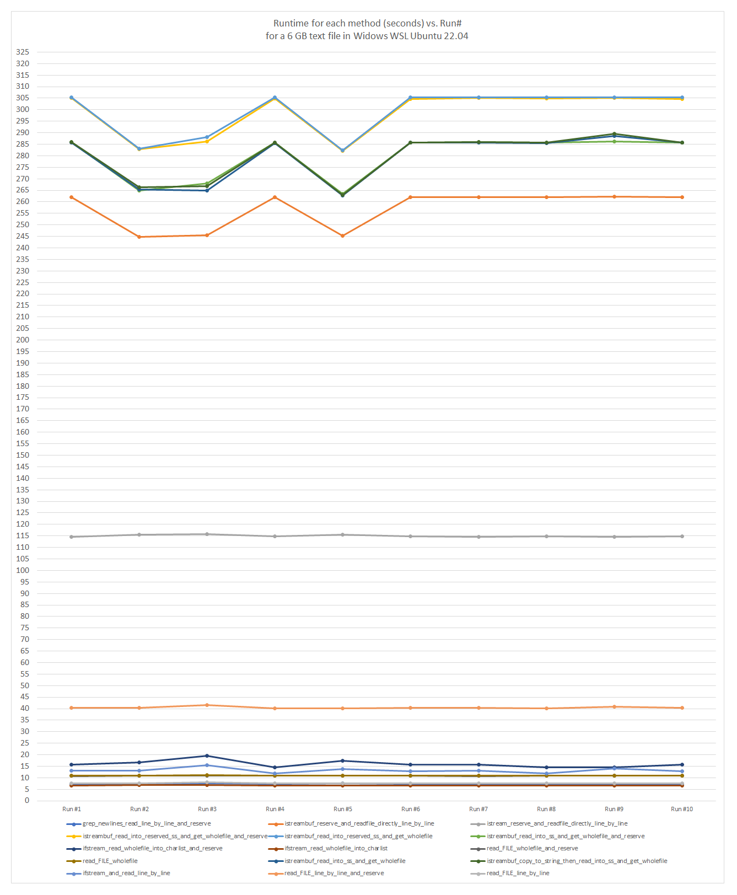

# File-Reading

Do a study on various file reading techniques in C and C++ and choose the best one based on the need of the project or an organization

## Objective

Fastest function to achieve all of this wins

* Read a large file and store all the new lines in a vector of string for further processing.
* Can be any C++ standard or level of optimization during compile.
* Cross-platform in Windows and Linux.

We will take the average from multiple runs for each function and determine the smallest runtime. Also show a graph of performance for various sizes.

## Setup
* Windows 10 WSL Ubuntu 22.04, g++ 11.4
* Windows 10 version 19045.3570
* C++14 

## Results

| Method of Reading  | Run #1  | Run #2  | Run #3  | Run #4  | Run #5  | Run #6  | Run #7  | Run #8  | Run #9  | Run #10 |
| :---         |          ---: |          ---: |          ---: |          ---: |          ---: |          ---: |          ---: |          ---: |          ---: |          ---: |
| grep_newlines_read_line_by_line_and_reserve  | 7.35 | 7.44 | 7.47 | 7.37 | 7.48 | 7.39 | 7.35 | 7.37 | 7.40 | 7.39 |
| istreambuf_reserve_and_readfile_directly_line_by_line  | 262.05 | 244.67 | 245.46 | 262.08 | 245.31 | 261.94 | 262.05 | 262.08 | 262.29 | 261.94 |
| istream_reserve_and_readfile_directly_line_by_line  | 114.48 | 115.50 | 115.79 | 114.86 | 115.53 | 114.72 | 114.48 | 114.86 | 114.66 | 114.72 |
| istreambuf_read_into_reserved_ss_and_get_wholefile_and_reserve  | 305.11 | 282.87 | 286.13 | 304.79 | 282.17 | 304.64 | 305.11 | 304.79 | 305.00 | 304.64 |
| istreambuf_read_into_reserved_ss_and_get_wholefile  | 305.41 | 283.20 | 288.21 | 305.39 | 282.33 | 305.23 | 305.41 | 305.39 | 305.45 | 305.23 |
| istreambuf_read_into_ss_and_get_wholefile_and_reserve  | 285.87 | 264.86 | 268.04 | 285.73 | 263.54 | 285.68 | 285.87 | 285.73 | 286.11 | 285.68 |
| ifstream_read_wholefile_into_charlist_and_reserve  | 15.61 | 16.73 | 19.42 | 14.45 | 17.40 | 15.71 | 15.61 | 14.45 | 14.61 | 15.71 |
| ifstream_read_wholefile_into_charlist  | 6.68 | 6.81 | 6.80 | 6.72 | 6.71 | 6.72 | 6.68 | 6.72 | 6.73 | 6.72 |
| read_FILE_wholefile_and_reserve  | 10.82 | 11.01 | 11.03 | 10.85 | 10.83 | 10.84 | 10.82 | 10.85 | 10.87 | 10.84 |
| read_FILE_wholefile  | 10.90 | 11.00 | 11.10 | 10.86 | 10.96 | 10.81 | 10.90 | 10.86 | 10.85 | 10.81 |
| istreambuf_read_into_ss_and_get_wholefile  | 285.73 | 265.45 | 264.96 | 285.47 | 262.72 | 285.64 | 285.73 | 285.47 | 288.55 | 285.64 |
| istreambuf_copy_to_string_then_read_into_ss_and_get_wholefile  | 285.95 | 266.24 | 266.76 | 285.72 | 262.94 | 285.71 | 285.95 | 285.72 | 289.50 | 285.71 |
| ifstream_and_read_line_by_line  | 13.11 | 13.04 | 15.58 | 11.97 | 13.78 | 12.85 | 13.11 | 11.97 | 14.02 | 12.85 |
| read_FILE_line_by_line_and_reserve  | 40.38 | 40.38 | 41.50 | 40.16 | 40.21 | 40.30 | 40.38 | 40.16 | 40.72 | 40.30 |
| read_FILE_line_by_line  | 7.49 | 7.65 | 8.15 | 7.48 | 7.59 | 7.50 | 7.49 | 7.48 | 7.65 | 7.50 |

  

